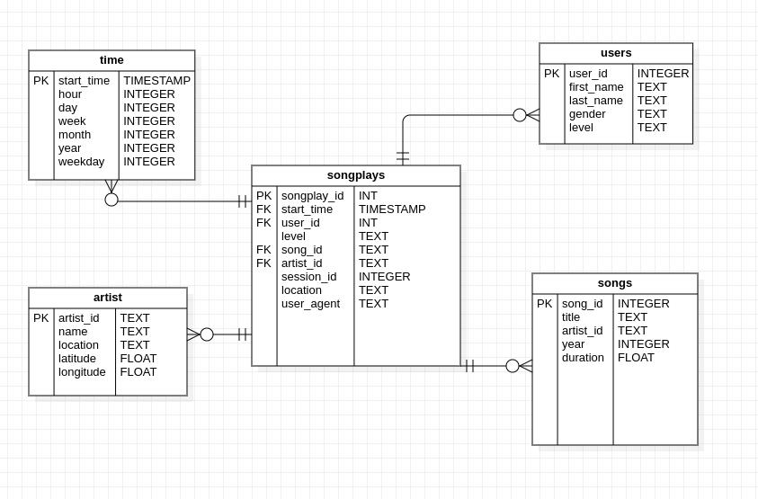

# Udacity - Project 1

<h1> Project: Data Modeling with Postgres </h1>

A startup called Sparkify wants to analyze the data they've been collecting on songs and user activity on their new music streaming app. The analytics team is particularly interested in understanding what songs users are listening to. Currently, they don't have an easy way to query their data, which resides in a directory of JSON logs on user activity on the app, as well as a directory with JSON metadata on the songs in their app.

In this context, a datawarehouse allows you to store data reliably and securely, while allowing greater agility in data analysis for business decision making.

An ETL pipeline was developed to extract, transform and load the JSONs into an relational database.
The collected data was processed and stored in the form of a star schema, allowing the business team to be able to analyze the songs heard by the customers using SQL queries.

<h1> Files description </h1>

The <code>images</code> folder is used for the purpose of storing the images used in this <code>README</code>. In short, it has the data model. 

<code>Data</code> folder is splitted into two repositories: <code>log_data</code> and <code>song_data</code>. Each json contained in the <code>song_data</code> folder is linked to a song, whose basic information is found in these files. In the <code>log_data</code> folder, each json file is the music playing events by users that occurred on a certain day of the year.

The file <code>sql_queries.py</code> contains the sql queries that are executed during pipeline execution. In summary, there are DROP, CREATE, SELECT and INSERT statements.

The <code>create_tables.py</code> file contains functions that create and connect to the database and execute the DDLs statements.

<code>etl.ipynb</code> is a jupyter notebook that allows the idealization and partial construction of the pipeline with easy debug.

The <code>etl.py</code> file contains functions that extract, transform and load the json files into the relational database.

<code>test.ipynb</code> is a jupyter notebook that run tests on the developed database.

<h1> Data description </h1>

Log_data brings information regarding the execution of songs by users in the application:

```javascript
{
    "artist":null,
    "auth":"Logged In",
    "firstName":"Celeste",
    "gender":"F",
    "itemInSession":1,
    "lastName":"Williams",
    "length":null,
    "level":"free",
    "location":"Klamath Falls, OR",
    "method":"GET",
    "page":"Home",
    "registration":1541077528796.0,
    "sessionId":52,
    "song":null,
    "status":200,
    "ts":1541207123796,
    "userAgent":"\"Mozilla\/5.0 (Windows NT 6.1; WOW64) AppleWebKit\/537.36 (KHTML, like Gecko) Chrome\/37.0.2062.103 Safari\/537.36\"",
    "userId":"53"
}
```
Song_data brings information regarding each music (song_id, title, duration, year) and its respective aritsts (artist_id, artist_longitude, artist_latitude, artist_location, artist_name)

```javascript
{
    "num_songs": 1,
    "artist_id": "ARMJAGH1187FB546F3",
    "artist_latitude": 35.14968,
    "artist_longitude": -90.04892,
    "artist_location": "Memphis, TN",
    "artist_name": "The Box Tops",
    "song_id": "SOCIWDW12A8C13D406",
    "title": "Soul Deep",
    "duration": 148.03546,
    "year": 1969
    }
```
The instances of these two objects were extract, transform and load into the Relational Database.

<h1> Data Model </h1>

The relational database contains the following tables:

time - DIM related to time;

users - DIM related to app users;

artists - DIM related to the artists of the songs that played in the app;

songs - DIM related to the songs played in the app;

songplays - FATO related to the playing songs in the app;



<h1> Running the Pipeline </h1>

